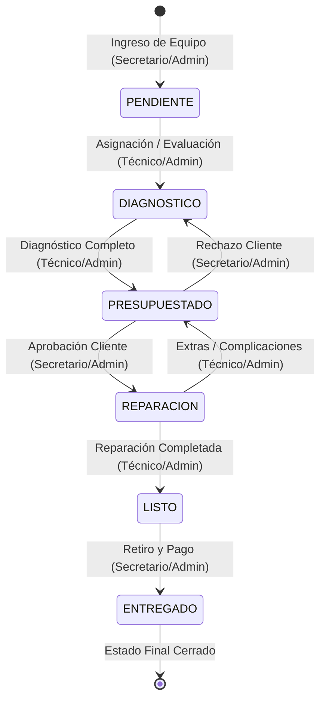

# Documentación Técnica Avanzada: TechFlow
## Sistema de Gestión de Órdenes de Servicio e ITSM

* **Materia:** Seminario de Lenguajes 2
* **Profesor:** Sadir, Pablo Ariel
* **Carrera:** Licenciatura en Sistemas
* **Integrantes:** Caballero Alberto, Luis Christian; Terán, Brian Ariel
* **Repositorio:** [Luis18A/ProyectoFinalSeminario2](https://github.com/Luis18A/ProyectoFinalSeminario2)

---

## 1. Descripción General

**TechFlow** es una plataforma web modular diseñada para la automatización, control y trazabilidad de los flujos de trabajo de soporte técnico e ITSM (IT Service Management) en talleres o departamentos de reparación de dispositivos electrónicos. El sistema centraliza la gestión operativa integral del negocio: desde la recepción y diagnóstico de equipos, pasando por la cotización de repuestos e insumos y el control de reparaciones, hasta la entrega y cobro final al cliente.

Además de su función transaccional básica, TechFlow incorpora capacidades avanzadas de:
1. **Inteligencia de Negocios y Analítica Gerencial:** Generación automática de KPIs operativos (MTTR, volumen financiero, Pareto de incidentes).
2. **Minería de Datos (Clustering de Clientes):** Segmentación automática de clientes mediante el algoritmo K-Means basado en su historial de consumo y fidelidad.
3. **Predicción de Fallas mediante Machine Learning:** Predicción asistida del diagnóstico técnico basada en la probabilidad estadística de fallas históricas asociadas a tipos específicos de dispositivos.
4. **Abastecimiento Externo Inteligente (Web Scraping Concurrente):** Búsqueda asíncrona y paralela de precios y stock de repuestos en proveedores líderes del mercado local.
5. **Notificaciones en Tiempo Real:** Actualizaciones instantáneas empujadas al navegador a través de Server-Sent Events (SSE).

### Stack Tecnológico Principal

```mermaid
graph TD
    subgraph Frontend [Capa de Presentación]
        A[HTML5 / CSS3 / Jinja2] --> B[Vanilla JavaScript]
        B --> C[AJAX / SSE Events]
    end

    subgraph Backend [Servidor de Aplicación Flask]
        D[Flask Blueprints] --> E[Controllers / Business Logic]
        E --> F[SQLAlchemy ORM]
        E --> G[Scraping Engine: Scrapling + Playwright]
        E --> H[SSE Service]
        E --> I[Thread Pool (Background Tasks)]
    end

    subgraph Persistence [Capa de Datos]
        F --> J[(PostgreSQL)]
    end
```

* **Core Backend:** Flask 3.0.0 (Python).
* **Persistencia y ORM:** SQLAlchemy, PostgreSQL.
* **Motor de Scraping:** `Scrapling` y `Playwright` con soporte para evasión de bloqueos (`curl_cffi`, `browserforge`).
* **Procesamiento Asíncrono:** Hilos nativos (`threading`) y programación asíncrona (`asyncio`) para la ejecución concurrente de scrapers en segundo plano.
* **Minería y Análisis de Datos:** `scikit-learn` (implementación de clústeres K-Means) y `numpy`.
* **Notificaciones Push:** Server-Sent Events (SSE) nativo sobre protocolos de streaming HTTP de Flask.
* **Frontend:** Plantillas dinámicas Jinja2, CSS3 con Tailwind (vía configuración de cliente estática) y Vanilla JavaScript para la interactividad asíncrona (Fetch API).
* **Seguridad:** Flask-WTF (CSRF), Werkzeug Security (Bcrypt/Scrypt hashing).

---

## 2. Arquitectura y Estructura de Carpetas

TechFlow implementa una arquitectura estructurada basada en el patrón de diseño **Modelo-Vista-Controlador (MVC)**, con una estricta separación de responsabilidades y dirección de llamadas unidireccional: **Rutas (Endpoints) ➔ Controladores (Lógica de Negocio) ➔ Modelos (Estructuras de Datos y Persistencia)**.

```
ProyectoFinalSeminario2/
│
├── app.py                      # Punto de entrada de la aplicación (Application Factory)
├── database.py                 # Inicialización y exposición de la instancia de SQLAlchemy
├── datos_prueba.py             # Generador de set de datos realista (Seeding manual)
├── requirements.txt            # Dependencias del proyecto de Python
├── .env.example                # Plantilla para variables de entorno locales
│
├── backend/                    # Código fuente del lado del servidor
│   ├── controller/             # Capa de lógica de negocio (Controllers)
│   │   ├── admin_controller.py
│   │   ├── analytics_controller.py
│   │   ├── auth_controller.py
│   │   ├── cliente_controller.py
│   │   ├── equipo_controller.py
│   │   ├── notificacion_controller.py
│   │   ├── orden_flujo_controller.py
│   │   ├── orden_presupuesto_controller.py
│   │   ├── orden_servicio_controller.py
│   │   ├── search_controller.py
│   │   ├── tipo_dispositivo_controller.py
│   │   └── usuario_controller.py
│   │
│   ├── models/                 # Definición de modelos SQLAlchemy
│   │   ├── Cliente.py
│   │   ├── Equipo.py
│   │   ├── EstadoOrden.py      # Enum con la máquina de estados de la orden
│   │   ├── HistorialEstado.py  # Registro histórico de auditoría de estados
│   │   ├── Notificacion.py
│   │   ├── OrdenRepuesto.py    # Modelo relacional intermedio (M:N)
│   │   ├── OrdenServicio.py
│   │   ├── Repuesto.py         # Modelo del catálogo de repuestos
│   │   ├── Rol.py
│   │   ├── TipoDispositivo.py
│   │   └── Usuario.py
│   │
│   ├── routes/                 # Blueprints que manejan endpoints e inyección de vistas
│   │   ├── admin_route.py
│   │   ├── cliente_route.py
│   │   ├── equipo_route.py
│   │   ├── notificacion_route.py
│   │   ├── orden_servicio_route.py
│   │   ├── tipo_dispositivo_route.py
│   │   ├── usuario_route.py
│   │   └── vistas_route.py      # Controlador de rutas de navegación
│   │
│   └── utils/                  # Herramientas y servicios auxiliares
│       ├── backup_service.py   # Exportación e importación atómica de base de datos
│       ├── db_seeder.py        # Sembrador automático al levantar la aplicación
│       ├── decorators.py       # Decoradores de control de acceso y roles (RBAC)
│       ├── kmeans_service.py   # Servicio de segmentación inteligente con scikit-learn
│       ├── predictor_service.py# Algoritmo de probabilidad de fallas normalizadas
│       ├── sse_service.py      # Gestor de suscripción e inyección de mensajes SSE
│       └── tasks.py            # Orquestación de web scraping (Celery + Threading fallback)
│
├── frontend/                   # Capa de presentación cliente
│   ├── static/                 # Recursos públicos del cliente
│   │   ├── css/                # Hojas de estilo de la plataforma (global.css, layout.css, etc.)
│   │   └── js/                 # Scripts interactivos (Fetch a endpoints de la API)
│   │
│   └── templates/              # Plantillas Jinja2 organizadas por módulos
│       ├── auth/               # Vistas del portal de login
│       ├── layout/             # Componentes comunes (base.html, header.html, sidebar.html)
│       └── componentes/        # Modales dinámicos e inyecciones parciales
│
└── scrappers/                  # Motores de extracción de datos para proveedores
    ├── fravega.py
    ├── fullstore.py
    ├── infopartes.py
    ├── megatone.py
    └── mercadoLibre.py
```

---

## 3. Requisitos Previos e Instalación

### 3.1. Requisitos del Sistema
* **Python:** Versión 3.10 o superior (Recomendado Python 3.12+ debido al uso de firmas de tiempo compatibles con la versión actual).
* **Base de datos:** PostgreSQL 14+ (Base de datos exclusiva para desarrollo y producción).
* **Navegador Headless:** Requerido por Playwright para la extracción dinámica.

### 3.2. Proceso de Instalación Paso a Paso

1. **Clonar el Repositorio:**
   ```bash
   git clone https://github.com/Luis18A/ProyectoFinalSeminario2.git
   cd ProyectoFinalSeminario2
   ```

2. **Crear e Inicializar el Entorno Virtual:**
   * **En Windows:**
     ```powershell
     python -m venv venv
     .\venv\Scripts\Activate.ps1
     ```
   * **En Linux/macOS:**
     ```bash
     python3 -m venv venv
     source venv/bin/activate
     ```

3. **Instalar Dependencias de Python:**
   ```bash
   pip install -r requirements.txt
   ```

4. **Instalar Navegadores de Playwright:**
   Para permitir que el motor de Web Scraping funcione correctamente, es necesario inicializar los binarios de Playwright de la siguiente manera:
   ```bash
   playwright install chromium
   ```

5. **Configurar el Entorno (`.env`):**
   Duplique el archivo `.env.example` en la raíz del proyecto y renómbrelo a `.env`. Edite las variables según sea necesario:
   ```bash
   cp .env.example .env
   ```

6. **Inicialización y Seeding de la Base de Datos:**
   La aplicación cuenta con inicialización inteligente de datos. Al iniciar el servidor web por primera vez, el sistema ejecutará de manera transparente:
   * Creación del esquema completo en la base de datos (`db.create_all()`).
   * Creación de roles fundamentales y usuarios administrativos básicos (Usuario: `admin`, Clave: `administrador`).
   * Creación de tipos predeterminados de dispositivos.
   * Si la variable de entorno `SEED_DB=true` está activa, inyectará un volumen realista de pruebas (clientes ficticios, equipos y órdenes históricas para evaluar el K-Means y el predictor de fallas).

7. **Ejecutar la Aplicación Localmente:**
   ```bash
   python app.py
   ```
   La aplicación estará disponible en `http://127.0.0.1:5000/`.


---

## 4. Modelo de Datos

El motor de persistencia relacional mapea 10 entidades principales a tablas de base de datos a través de SQLAlchemy ORM. Se detalla la estructura física actual de la base de datos:

```
  +---------+          +---------+          +-------------------+
  |   Rol   |1        N| Usuario |1        N| HistorialEstado   |
  +---------+          +---------+          +-------------------+
                       | - id    |          | - orden_id        |
                       +---------+          | - usuario_id      |
                                            +-------------------+
                                                      N
  +------------------+         +---------+            |1
  | TipoDispositivo  |1       N|  Equipo |1          N|  OrdenServicio    |
  +------------------+         +---------+            +-------------------+
                               | - id    |            | - id              |
                               +---------+            | - usuario_id      |
                                    N                 | - equipo_id       |
                                    |                 +-------------------+
                                    |1                          1
                               +---------+                      |
                               | Cliente |                      |
                               +---------+                      |1
                                                                N
  +------------------+         +---------+            +-------------------+
  |     Repuesto     |1       N|  Orden  |N          1|   Notificacion    |
  +------------------+         |Repuesto |            +-------------------+
                               +---------+
```

### 4.1. Tabla: `usuario` (Modelo: `Usuario`)
Almacena las credenciales y el estado operativo del personal del taller.
* **PK:** `id` (Integer, Autoincrement)
* **Atributos:**
  * `username` (String(80), UNIQUE, NOT NULL): Nombre identificador único de inicio de sesión (almacenado en minúsculas).
  * `password` (String(255), NOT NULL): Hash Bcrypt de la contraseña del usuario.
  * `nombre` (String(80), NOT NULL): Nombre del personal.
  * `apellido` (String(80), NOT NULL): Apellido del personal.
  * `rol_id` (Integer, FK ➔ `rol.id`, NOT NULL): Rol asignado para el control de accesos.
  * `activo` (Boolean, default True): Define si la cuenta de usuario se encuentra habilitada.
  * `intentos_fallidos` (Integer, default 0): Contador para el bloqueo automático de cuenta.

### 4.2. Tabla: `rol` (Modelo: `Rol`)
Define los niveles jerárquicos del sistema.
* **PK:** `id` (Integer, Autoincrement)
* **Atributos:**
  * `descripcion` (String(80), UNIQUE, NOT NULL): Nombre representativo (ej. "Administrador", "Técnico", "Secretario").

### 4.3. Tabla: `cliente` (Modelo: `Cliente`)
Almacena el registro maestro de los clientes.
* **PK:** `id` (Integer, Autoincrement)
* **Atributos:**
  * `dni_cuil` (String(20), UNIQUE, NOT NULL): Documento de identidad nacional o tributario.
  * `nombre` (String(50), NOT NULL): Nombres del cliente.
  * `apellido` (String(50), NOT NULL): Apellidos del cliente.
  * `telefono` (String(20), NOT NULL): Teléfono de contacto.
  * `email` (String(254), UNIQUE, Nullable): Correo electrónico.
  * `domicilio` (String(150), NOT NULL): Calle, número y departamento.
  * `localidad` (String(100), NOT NULL): Localidad o ciudad de residencia.
  * `fecha_registro` (DateTime, default `now()`): Fecha y hora de registro.

### 4.4. Tabla: `tipo_dispositivo` (Modelo: `TipoDispositivo`)
Clasificación general de los equipos del cliente.
* **PK:** `id` (Integer, Autoincrement)
* **Atributos:**
  * `descripcion` (String(80), UNIQUE, NOT NULL): Categoría de equipo (ej. "Notebook", "Celular", "Impresora").

### 4.5. Tabla: `equipo` (Modelo: `Equipo`)
Ficha técnica del equipo a reparar.
* **PK:** `id` (Integer, Autoincrement)
* **Atributos:**
  * `cliente_id` (Integer, FK ➔ `cliente.id`, NOT NULL): Propietario del equipo.
  * `marca` (String(80), NOT NULL): Marca del fabricante.
  * `modelo` (String(80), NOT NULL): Modelo comercial.
  * `numero_serie` (String(80), UNIQUE, NOT NULL): Identificador físico único de fábrica.
  * `tipo_id` (Integer, FK ➔ `tipo_dispositivo.id`, NOT NULL): Clasificación física del dispositivo.
  * `descripcion` (String(500), Nullable): Detalles cosméticos o de hardware.
* **Propiedades Dinámicas (Python):**
  * `estado_actual`: Devuelve el último estado de orden registrado o "Disponible" si no posee historial operativo activo.

### 4.6. Tabla: `orden_servicio` (Modelo: `OrdenServicio`)
Registro transaccional de las operaciones técnicas e ITSM.
* **PK:** `id` (Integer, Autoincrement)
* **Atributos:**
  * `usuario_id` (Integer, FK ➔ `usuario.id`, NOT NULL): Técnico / Operador asignado que recepciona el ticket.
  * `equipo_id` (Integer, FK ➔ `equipo.id`, NOT NULL): Dispositivo sujeto a reparación.
  * `falla_reportada` (String(500), NOT NULL): Descripción del problema manifestada por el cliente.
  * `accesorios` (String(500), NOT NULL): Accesorios adicionales dejados en depósito (ej. cables, cargador, funda).
  * `estado` (Enum(EstadoOrden), default `PENDIENTE`): Estado operativo actual dentro del workflow del taller.
  * `estado_diagnostico` (String(255), Nullable): Observaciones técnicas resultantes de la etapa de evaluación diagnóstica.
  * `fecha_recepcion` (DateTime, default `now()`): Fecha y hora del ingreso.
  * `fecha_entrega` (DateTime, Nullable): Fecha y hora efectiva de salida del taller.
  * `costo` (Numeric(10,2), Nullable): Monto consolidado total cobrado al cliente (Mano de Obra + Repuestos).
  * `observaciones` (String(500), Nullable): Notas internas o aclaraciones.
* **Relaciones M:N:**
  * `orden_repuestos` (Relación ➔ `OrdenRepuesto`): Colección de repuestos asignados a esta orden específica.
* **Propiedades Dinámicas (Python):**
  * `repuestos`: Retorna una lista estructurada formateada como DTO de los repuestos consumidos en la orden actual para facilitar el renderizado de facturación en vistas Jinja.

### 4.7. Tabla: `historial_estados` (Modelo: `HistorialEstado`)
Pistas de auditoría del workflow de órdenes de servicio.
* **PK:** `id` (Integer, Autoincrement)
* **Atributos:**
  * `orden_id` (Integer, FK ➔ `orden_servicio.id`, NOT NULL, CASCADE ON DELETE): Orden afectada por el cambio.
  * `estado_anterior` (String(50), NOT NULL): Estado previo.
  * `estado_nuevo` (String(50), NOT NULL): Estado resultante.
  * `fecha_cambio` (DateTime, default `now()`): Instante exacto del cambio de estado.
  * `usuario_id` (Integer, FK ➔ `usuario.id`, NOT NULL): Operador que ejecutó la transición.
  * `observacion_tecnica` (Text, Nullable): Justificación técnica o informe del cambio.

### 4.8. Tabla: `notificacion` (Modelo: `Notificacion`)
Alertas internas enviadas a los operadores.
* **PK:** `id` (Integer, Autoincrement)
* **Atributos:**
  * `usuario_id` (Integer, FK ➔ `usuario.id`, NOT NULL): Operador destinatario de la alerta.
  * `titulo` (String(100), NOT NULL): Breve resumen del evento.
  * `mensaje` (String(500), NOT NULL): Detalle del evento o tarea requerida.
  * `leido` (Boolean, default False): Bandera lógica que rastrea si el usuario vio el mensaje en el frontend.
  * `fecha_creacion` (DateTime, default `now()`): Instante de creación del mensaje.
  * `orden_id` (Integer, FK ➔ `orden_servicio.id`, Nullable): Enlace opcional a la orden relacionada.

### 4.9. Tabla: `repuesto` (Modelo: `Repuesto`)
Catálogo unificado de materiales y repuestos físicos que pueden ser asignados a los presupuestos.
* **PK:** `id` (Integer, Autoincrement)
* **Atributos:**
  * `codigo` (String(50), UNIQUE, NOT NULL): Código alfanumérico único para control del inventario (ej. `REP-5AB23CF4`).
  * `descripcion` (String(200), NOT NULL): Nombre comercial detallado del repuesto.
  * `categoria` (String(50), Nullable): Clasificación técnica (ej. "Hardware", "Pantallas", "Baterías").
  * `precio_promedio` (Numeric(10,2), Nullable): Costo referencial de venta unitario.
  * `proveedor` (String(100), Nullable): Identificador del origen o tienda de procedencia (ej. "MercadoLibre", "Megatone").
  * `activo` (Boolean, default True): Estado lógico del repuesto.

### 4.10. Tabla: `orden_repuesto` (Modelo: `OrdenRepuesto`)
Tabla intermedia asociativa con atributos adicionales para modelar la relación de muchos a muchos (M:N) entre `OrdenServicio` y `Repuesto`.
* **PK:** `id` (Integer, Autoincrement)
* **Restricción UNIQUE:** `(orden_id, repuesto_id)`
* **Atributos:**
  * `orden_id` (Integer, FK ➔ `orden_servicio.id` con `ON DELETE CASCADE`, NOT NULL, Index): Identificador de la orden de servicio.
  * `repuesto_id` (Integer, FK ➔ `repuesto.id` con `ON DELETE CASCADE`, NOT NULL, Index): Identificador del repuesto asignado.
  * `cantidad` (Integer, NOT NULL, default 1): Unidades del insumo utilizadas.
  * `precio_unitario` (Numeric(10,2), NOT NULL): Precio unitario fijado al momento de la cotización o scraping del repuesto.
  * `fecha_agregado` (DateTime, default `now()`): Momento exacto de carga al ticket.

---

## 5. Máquina de Estados y Workflow Técnico

El ciclo de vida de un equipo dentro del taller sigue una máquina de estados estricta y controlada lógicamente por el enumerado `EstadoOrden` (en `backend/models/EstadoOrden.py`). Los estados válidos son: `PENDIENTE`, `DIAGNOSTICO`, `PRESUPUESTADO`, `REPARACION`, `LISTO`, y `ENTREGADO`.



### Reglas de Negocio y Transiciones Permitidas:

| Estado Origen | Estado Destino | Rol Permitido | Regla de Negocio / Efecto Asociado |
| :--- | :--- | :--- | :--- |
| **Cualquiera** | **PENDIENTE** | Secretario, Admin | Estado inicial por defecto de un equipo recién ingresado al taller. |
| **PENDIENTE** | **DIAGNOSTICO** | Técnico, Admin | El equipo es tomado por el taller para realizar análisis técnico. |
| **DIAGNOSTICO** | **PRESUPUESTADO**| Técnico, Admin | Requiere el registro técnico de la falla. Se recalcula el valor total del ticket. |
| **PRESUPUESTADO**| **REPARACION** | Secretario, Admin | Aprobación explícita del cliente. Inicia la mano de obra del técnico. |
| **PRESUPUESTADO**| **DIAGNOSTICO** | Secretario, Admin | Si el cliente rechaza los costos o solicita cambios presupuestarios. |
| **REPARACION** | **LISTO** | Técnico, Admin | Finalización exitosa del servicio técnico. Se notifica al secretario el retiro. |
| **REPARACION** | **PRESUPUESTADO**| Técnico, Admin | Retroceso controlado si durante la reparación surgen problemas adicionales no contemplados. |
| **LISTO** | **ENTREGADO** | Secretario, Admin | Cierre definitivo de la orden. Se registra la fecha final y se inhabilita cualquier edición. |

---

## 6. Seguridad y Control de Acceso

El sistema incorpora protecciones avanzadas contra vectores de ataque de seguridad comunes del estándar OWASP:

1. **Control de Acceso basado en Roles (RBAC):**
   Las rutas están decoradas con `@login_required` y `@role_required(...)` en la capa de endpoints, garantizando control a nivel de API sobre las operaciones.
   * **Administrador:** Acceso total, incluyendo el panel de analíticas, gestión de operadores, copias de seguridad de base de datos y simulación de perfiles.
   * **Secretario:** Gestión de clientes, carga de equipos, creación y actualización de estado comercial de órdenes (aprobación, egresos).
   * **Técnico:** Acceso exclusivo a la interfaz de taller (`technician_board.html`), donde gestiona sus órdenes de trabajo, realiza diagnósticos, busca y asocia repuestos y notifica la finalización.

2. **Mitigación de Vulnerabilidades Específicas:**
   * **Inyección SQL (SQLi):** Todas las interacciones con la base de datos se ejecutan de manera nativa mediante las sentencias de consulta parametrizadas del compilador de SQLAlchemy ORM.
   * **Fijación de Sesión (Session Fixation):** En cada login, se ejecuta una llamada a `session.clear()` eliminando las cookies preexistentes del navegador antes de inyectar las nuevas credenciales de sesión autorizada.
   * **Cross-Site Request Forgery (CSRF):** Middleware global configurado con `CSRFProtect` de Flask-WTF. Las cookies de sesión operan restrictivamente con `SESSION_COOKIE_SAMESITE='Lax'` y `SESSION_COOKIE_HTTPONLY=True` (invisibles al script de cliente JavaScript).
   * **Timing Attacks & Fuerza Bruta:** Las validaciones de contraseñas se realizan siempre antes del control del estado del usuario. El sistema bloquea automáticamente la cuenta del usuario (`activo=False`) al registrarse 5 intentos fallidos de login consecutivos, requiriendo el desbloqueo por parte de un Administrador.

---

## 7. Componentes Clave y Lógica del Sistema

### 7.1. Módulo de Scraping y Abastecimiento (Scrapling + Playwright)
La lógica de scraping se ejecuta asíncronamente en segundo plano de la siguiente manera:
1. El controlador `orden_presupuesto_controller.iniciar_busqueda_repuestos` lanza de forma nativa un hilo daemon (`threading.Thread`) que ejecuta un event loop aislado de `asyncio` sin bloquear el hilo principal de atención web del servidor Flask.
2. Dentro de este hilo secundario, se ejecutan de manera concurrente y paralela (`asyncio.gather` con `asyncio.to_thread`) los scrapers de los distintos proveedores: **MercadoLibre**, **Megatone**, **Fravega**, **InfoPartes**, y **Fullstore**.
3. Cada extractor utiliza `DynamicFetcher` de la librería `scrapling` para levantar navegadores virtuales sin cabecera (headless) e inyectar huellas y agentes de usuario provistos por `browserforge` para evitar bloqueos antibot.
4. Los resultados son consolidados, filtrados por coincidencia semántica de tokens (excluyendo preposiciones del filtro `STOP_WORDS`) para asegurar la relevancia, y ordenados de menor a mayor precio.

### 7.2. Módulo de Analytics y K-Means (`kmeans_service.py`)
El servicio `KMeansService` procesa de forma nativa la información histórica del negocio usando `scikit-learn` para segmentar a los clientes:
* **Entradas:** Frecuencia de visitas de clientes (tickets totales) y gasto acumulado real en mano de obra y repuestos en la base de datos (excluyendo órdenes canceladas o pendientes).
* **Normalización:** Se aplica una normalización de características mediante Min-Max Scaling al rango $[0, 1]$ para equilibrar la dimensionalidad (evitando que la magnitud de los montos financieros opaque la cantidad de visitas).
* **Adaptación de K:** El valor del clúster se autoajusta de forma adaptativa ($K = \min(3, N\_Clientes)$) para soportar de manera elegante bases de datos pequeñas sin generar excepciones.
* **Caché con TTL:** Para proteger el rendimiento, el clúster calculado se almacena en memoria caché con un ciclo de vida de expiración de 5 minutos.
* **Clasificación Dinámica:** Los grupos resultantes son categorizados automáticamente de menor a mayor gasto consolidado en tres segmentos de negocio: *Casual/Nuevo*, *Activo/Frecuente* y *Cliente Platinum*.

### 7.3. Módulo de Predicción de Fallas (`predictor_service.py`)
Facilita la tarea diagnóstica del personal técnico:
1. Al ingresar un equipo a diagnóstico, el frontend consulta los datos del predictor.
2. El servicio mapea semánticamente descripciones históricas no estructuradas utilizando un analizador heurístico de cadenas de caracteres, clasificándolas en categorías limpias (ej. "Prende y se apaga", "Cortocircuito en cargador" ➔ *Falla de alimentación / Carga*).
3. Determina la tasa de incidencia (probabilidad relativa sobre el total de incidencias del mismo tipo de dispositivo) y la tasa histórica de efectividad de reparación exitosa (estados `LISTO` o `ENTREGADO`).
4. Requiere un set mínimo de 2 órdenes históricas del mismo tipo de dispositivo para brindar predicciones confiables; de lo contrario, retorna un estado controlado de información insuficiente.

### 7.4. Módulo de Notificaciones SSE (`sse_service.py`)
Proporciona actualizaciones visuales al instante:
* Expone un stream de salida HTTP persistente (`text/event-stream`) a través de la ruta `/notificaciones/stream`.
* Para evitar el agotamiento del pool de conexiones de la base de datos de SQLAlchemy, el flujo cierra inmediatamente el cursor del hilo asociado antes de entrar al bucle infinito de escucha de la cola.
* Emplea un temporizador de latido (ping de 3 segundos) para monitorear el estado de la conexión TCP del cliente, permitiendo liberar inmediatamente de memoria las colas inactivas y los hilos en caso de cierre abrupto de pestañas del navegador.

---

## 8. Referencia de la API (Ruteo)

A continuación se detallan de forma exhaustiva todos los endpoints expuestos en el backend de la aplicación, agrupados por su correspondiente Blueprint lógico:

### 8.1. Blueprint: `vistas` (Rutas de Plantillas y Control de Navegación)

| Método | Ruta | Parámetros Requeridos | Respuestas | Acceso / Roles |
| :--- | :--- | :--- | :--- | :--- |
| **GET** | `/` | Ninguno | Redirige al dashboard según el rol o renderiza `login.html` | Público |
| **POST** | `/login` | `username` (Form), `password` (Form) | Guarda variables de sesión y redirige al dashboard | Público |
| **GET** | `/logout` | Ninguno | Limpia la sesión actual del usuario y redirige a `/` | Autenticado |
| **GET** | `/dashboard` | Ninguno | Renderiza `admin_analytics.html` con estadísticas de negocio | `Administrador` |
| **GET** | `/secretary` | Ninguno | Redirige internamente a la vista `/ordenServicio/activas` | `Secretario`, `Administrador` |
| **GET** | `/technician` | Ninguno | Renderiza `technician_board.html` con las órdenes del técnico | `Técnico`, `Administrador` |
| **GET** | `/api/global-search`| `q` (Query string) | JSON de coincidencias en clientes, equipos y órdenes | Autenticado (Técnicos no ven clientes/equipos) |

### 8.2. Blueprint: `usuarios` (Gestión Operativa de Operadores)

| Método | Ruta | Parámetros Requeridos | Respuestas | Acceso / Roles |
| :--- | :--- | :--- | :--- | :--- |
| **GET** | `/usuarios` | Ninguno | Renderiza `gestion_usuarios.html` con lista de operadores | `Administrador` |
| **POST** | `/usuarios` | `username`, `password`, `nombre`, `apellido`, `rol_id` (Form) | Crea operador. Retorna redirección o JSON (AJAX) | `Administrador` |
| **POST** | `/usuarios/actualizar/<id>`| `nombre`, `apellido`, `rol_id`, `activo` (Form) | Modifica operador. Retorna redirección o JSON (AJAX) | `Administrador` |
| **POST** | `/usuarios/eliminar/<id>`| `id` (URL path) | Deshabilita/Elimina usuario en la base de datos | `Administrador` |

### 8.3. Blueprint: `clientes` (CRM de Clientes)

| Método | Ruta | Parámetros Requeridos | Respuestas | Acceso / Roles |
| :--- | :--- | :--- | :--- | :--- |
| **GET** | `/clientes` | `q` (Query string opcional) | Renderiza `gestion_cliente.html` con listado filtrado | `Secretario`, `Administrador` |
| **POST** | `/clientes` | `dni_cuil`, `nombre`, `apellido`, `telefono`, `email`, `domicilio`, `localidad` (Form) | Registra un nuevo cliente y actualiza el panel | `Secretario`, `Administrador` |
| **POST** | `/clientes/editar/<id>` | `nombre`, `apellido`, `telefono`, `email`, `domicilio`, `localidad` (Form) | Modifica los datos personales de contacto del cliente | `Secretario`, `Administrador` |
| **GET** | `/clientes/buscar` | `q` (Query string) | JSON con coincidencias parciales para autocompletar | `Secretario`, `Administrador` |
| **GET** | `/clientes/verificar-dni/<dni>`| `dni` (URL path) | JSON indicando si existe el DNI y los datos de ficha | `Secretario`, `Administrador` |

### 8.4. Blueprint: `equipo` (Inventario de Equipos Técnicos)

| Método | Ruta | Parámetros Requeridos | Respuestas | Acceso / Roles |
| :--- | :--- | :--- | :--- | :--- |
| **GET** | `/equipos/<cliente_id>`| `cliente_id` (URL path) | Renderiza `gestion_equipos.html` asociado al cliente | `Secretario`, `Administrador` |
| **POST** | `/equipo` | `cliente_id`, `marca`, `modelo`, `numero_serie`, `tipo_id`, `descripcion` (Form) | Asocia un nuevo dispositivo físico a la ficha del cliente | `Secretario`, `Administrador` |
| **POST** | `/equipo/editar/<id>` | `marca`, `modelo`, `numero_serie`, `tipo_id`, `descripcion` (Form) | Modifica los datos técnicos de un dispositivo | `Secretario`, `Administrador` |
| **GET** | `/clientes/<cliente_id>/equipos` | `cliente_id` (URL path) | JSON con la lista de equipos registrados de un cliente | `Secretario`, `Administrador` |

### 8.5. Blueprint: `tipo_dispositivo` (Categorías de Inventario)

| Método | Ruta | Parámetros Requeridos | Respuestas | Acceso / Roles |
| :--- | :--- | :--- | :--- | :--- |
| **POST** | `/tipoDispositivo/rapido`| `descripcion` (Form) | JSON con la confirmación de la nueva categoría creada | `Secretario`, `Administrador` |

### 8.6. Blueprint: `orden_servicio` (Workflow Transaccional del Taller y Scraping)

| Método | Ruta | Parámetros Requeridos | Respuestas | Acceso / Roles |
| :--- | :--- | :--- | :--- | :--- |
| **GET** | `/ordenServicio/activas`| `ticket_id`, `cliente`, `equipo` (Query string opcionales) | Renderiza `listar_ordenes.html` con filtros de búsqueda | `Secretario`, `Administrador` |
| **POST** | `/ordenServicio` | `equipo_id`, `usuario_id`, `falla_reportada`, `accesorios` (Form) | Crea una orden de servicio en estado `PENDIENTE` | `Secretario`, `Administrador` |
| **ROUTE**| `/tablero-tickets/<orden_id>`| `readonly` (Query string opcional `true`/`false`) | Renderiza la consola técnica del ticket `gestionar_ticket.html` | `Técnico`, `Secretario`, `Administrador` |
| **POST** | `/ordenServicio/editar/<id>` | `estado_diagnostico`, `costo` (mano de obra) (Form) | Modifica diagnóstico técnico inicial e introduce mano de obra | `Técnico`, `Secretario`, `Administrador` |
| **POST** | `/ordenServicio/<orden_id>/actualizar-estado-flujo`| `estado`, `observaciones` (Form) | Valida máquina de estados, transiciona y registra auditoría | `Técnico`, `Secretario`, `Administrador` |
| **GET** | `/historial` | `ticket_id`, `cliente`, `equipo` (Query string opcionales) | Renderiza `historial_tickets.html` de órdenes archivadas | `Administrador` |
| **GET** | `/historial/exportar` | Filtros de historial (Query string opcionales) | Retorna un archivo CSV plano con la información filtrada | `Administrador` |
| **GET** | `/comprobante/<orden_id>`| `orden_id` (URL path) | Renderiza `comprobante.html` optimizado para impresión A4 | `Técnico`, `Secretario`, `Administrador` |
| **POST** | `/ordenServicio/<orden_id>/repuesto/agregar` | `codigo`, `descripcion`, `precio_unitario`, `proveedor` (Form) | Registra/Vincula un repuesto a la orden (AJAX) | `Técnico`, `Administrador` |
| **POST** | `/ordenServicio/<orden_id>/repuesto/editar/<orden_repuesto_id>` | `precio_unitario`, `cantidad` (Form) | Modifica la cotización o cantidad del repuesto asignado | `Técnico`, `Administrador` |
| **POST** | `/ordenServicio/<orden_id>/repuesto/eliminar/<orden_repuesto_id>`| `orden_repuesto_id` (URL path) | Desvincula el repuesto del ticket. Recalcula costo consolidado | `Técnico`, `Administrador` |
| **GET** | `/ordenServicio/<orden_id>/json-config`| `readonly` (Query string opcional) | JSON de configuración de botones según rol y estado | `Técnico`, `Secretario`, `Administrador` |
| **POST** | `/api/buscar-repuestos/iniciar`| `q` (Form o JSON) | Inicia el scraping en segundo plano y devuelve `task_id` | Autenticado |
| **GET** | `/api/buscar-repuestos/estado/<task_id>`| `task_id` (URL path) | JSON con el estado de la tarea (`running`/`completed`/`failed`) | Autenticado |

### 8.7. Blueprint: `notificaciones` (Alertas en Tiempo Real)

| Método | Ruta | Parámetros Requeridos | Respuestas | Acceso / Roles |
| :--- | :--- | :--- | :--- | :--- |
| **POST** | `/notificaciones/<id>/leer`| `id` (URL path) | JSON de confirmación de lectura de notificación específica | Autenticado |
| **POST** | `/notificaciones/leer-todas`| Ninguno | JSON de confirmación marcando todas las alertas leídas | Autenticado |
| **GET** | `/notificaciones/stream`| Ninguno | Canal SSE continuo (`text/event-stream`) de alertas activas | Autenticado |

### 8.8. Blueprint: `admin` (Utilidades de Sistema y Backups)

| Método | Ruta | Parámetros Requeridos | Respuestas | Acceso / Roles |
| :--- | :--- | :--- | :--- | :--- |
| **GET** | `/admin/backup/download` | Ninguno | Genera un archivo binario nativo (`.dump` comprimido) de resguardo | `Administrador` |
| **GET** | `/admin/cambiar-rol` | `rol` (Query string con nuevo rol a simular) | Modifica temporalmente el rol del administrador | `Administrador` |

---

## 9. Procedimiento de Backup y Restauración

El sistema cuenta con un motor de respaldo completo e independiente de base de datos implementado en `backend/utils/backup_service.py` y expuesto en el panel de analíticas para el administrador:

### 9.1. Exportación (Backup)
* **Acción:** El administrador presiona "Descargar Backup".
* **Proceso:** La aplicación ejecuta `BackupService.generate_backup_dump()`, que autodetecta la ubicación de la herramienta cliente `pg_dump` de PostgreSQL (en el PATH del sistema o en rutas estándar de Windows como `C:\Program Files\PostgreSQL\18\bin`) y ejecuta un subproceso de volcado comprimido del catálogo completo de base de datos de forma atómica y segura (utilizando variables de entorno del proceso para la contraseña para evitar fugas).
* **Salida:** Se descarga un archivo binario comprimido de base de datos en formato personalizado de PostgreSQL con extensión `.dump` y nombre estructurado `techflow_backup_YYYYMMDD_HHMMSS.dump`.

### 9.2. Importación y Restauración (Restore)
* **Acción:** Ejecución programática o restauración directa usando `BackupService.restore_backup_dump(filepath)`.
* **Proceso Atómico:**
  1. Se ejecuta `pg_restore` apuntando a la base de datos objetivo con el modificador `--clean` y `--if-exists`.
  2. Esto elimina de forma segura los objetos del esquema actual en el orden inverso correcto y los recrea a partir del archivo binario de respaldo sin violar restricciones de integridad referencial.
  3. El proceso es administrado directamente a nivel de base de datos relacional de PostgreSQL, lo cual optimiza al máximo el tiempo de ejecución y la consistencia transaccional.
