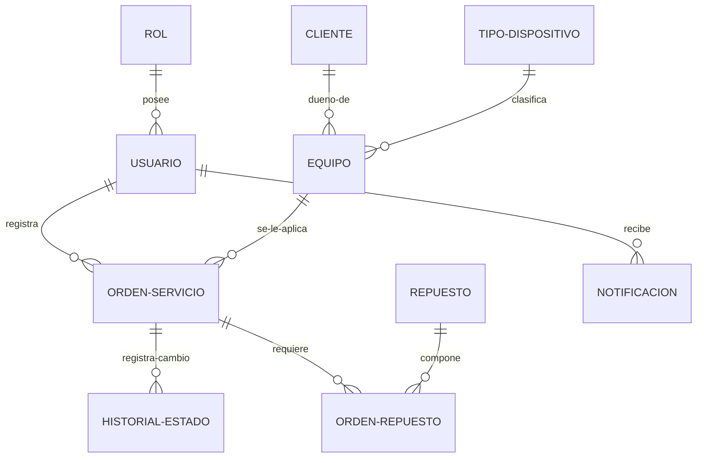

# Documentación Técnica del Sistema TechFlow

Este documento provee un análisis técnico exhaustivo de la plataforma **TechFlow**, un sistema integral de gestión para talleres de soporte técnico de dispositivos electrónicos. Está diseñado como referencia para desarrolladores, mantenedores e ingenieros de software encargados del soporte o la evolución del código base.

---

## 1. Resumen de Arquitectura y Stack Tecnológico

TechFlow se implementa bajo un patrón arquitectónico de **Monolito de Tres Capas** estructurado según el patrón de diseño **MVC (Modelo-Vista-Controlador)**:

```mermaid
graph TD
    Client[Navegador del Cliente / Frontend] -->|Peticiones HTTP / AJAX| Routes[Rutas / Blueprints]
    Routes -->|Invoca| Controllers[Controladores - Lógica de Negocio]
    Controllers -->|Lee/Escribe| Models[Modelos ORM - SQLAlchemy]
    Models -->|Mapea a| DB[(Base de Datos - SQLite / PostgreSQL)]
    Controllers -->|Lanza en Hilos| Scrapers[Scrapers Web - Hilos de Fondo]
    Controllers -->|Invoca| ML[Minería de Datos - KMeans scikit-learn]
```



### Stack Tecnológico Principal:
* **Backend**: Python 3.11.8 y Flask 3.0.0 como micro-framework web.
* **ORM (Capa de Acceso a Datos)**: Flask-SQLAlchemy (capa sobre SQLAlchemy) para abstracción de base de datos relacional.
* **Base de Datos**: SQLite (`techflow.db` en modo local/desarrollo) y soporte nativo para PostgreSQL en despliegues de producción (mediante `psycopg2-binary`).
* **Motor de Plantillas**: Jinja2 integrado en Flask para el renderizado dinámico del frontend.
* **Frontend**: HTML5 semántico, Vanilla JavaScript (ES6+), y CSS estructurado (basado en Tailwind CSS).
* **Minería de Datos e Inteligencia de Negocio**: `scikit-learn` y `numpy` para agrupación y segmentación de clientes mediante K-Means.
* **Web Scraping**: Librería `scrapling` (con soporte para Camoufox/StealthyFetcher y Playwright) para la recolección automática de precios de repuestos.
* **Concurrencia**: Hilos nativos (`threading`) para procesamiento asíncrono y no bloqueante de consultas de repuestos en el servidor Flask.

---

## 2. Estructura del Proyecto y Organización de Directorios

La organización de directorios del proyecto se detalla a continuación:

* **`/instance/`**: Contiene la base de datos local SQLite (`techflow.db`) y archivos transitorios de base de datos.
* **`/scrappers/`**: Módulos independientes de scraping web:
  * `mercadoLibre.py`: Scraper adaptado a los layouts clásicos y modernos (`.poly-card`) de MercadoLibre Argentina.
  * `megatone.py`, `fravega.py`, `infopartes.py`, `fullstore.py`: Scrapers dedicados a portales mayoristas y minoristas de tecnología.
* **`/backend/`**: Núcleo lógico del servidor:
  * **`/models/`**: Clases de persistencia mapeadas mediante SQLAlchemy ORM:
    * `Usuario.py`, `Rol.py`: Modelos de autenticación, control de acceso y autorizaciones.
    * `Cliente.py`, `Equipo.py`, `TipoDispositivo.py`: Entidades base de clientes y los dispositivos a reparar.
    * `OrdenServicio.py`: Entidad principal del ciclo de vida de un ticket de servicio.
    * `Repuesto.py`, `OrdenRepuesto.py`: Estructura relacional intermedia para cotizar repuestos por orden.
    * `Notificacion.py`: Gestión de alertas internas del sistema.
    * `HistorialEstado.py`: Historial de transiciones de estados de las órdenes (auditoría).
  * **`/controller/`**: Lógica de negocio pura e integraciones:
    * `auth_controller.py`: Control de sesiones, validaciones de credenciales y encriptación de contraseñas mediante `werkzeug.security`.
    * `orden_servicio_controller.py`: Coordinación de órdenes, asignación de técnicos y tableros específicos por rol.
    * `orden_presupuesto_controller.py`: Manejo financiero del presupuesto, adición de repuestos y simulación asíncrona de scraping mediante hilos.
    * `analytics_controller.py`: Cálculos de indicadores clave (KPIs), tiempos promedio de resolución (MTTR), velocidad de incidentes y segmentación K-Means.
    * `search_controller.py`: Lógica para el buscador global y unificación de resultados.
  * **`/routes/`**: Controladores de endpoints HTTP organizados por Blueprints de Flask:
    * `vistas_route.py`: Enrutamiento y renderización de las vistas del frontend (Login, Dashboard, Tableros).
    * `orden_servicio_route.py`, `cliente_route.py`, `equipo_route.py`, `usuario_route.py`: Endpoints RESTful para operaciones CRUD and peticiones AJAX.
  * **`/utils/`**: Clases auxiliares y decoradores:
    * `decorators.py`: Validadores `@login_required` y `@role_required` para interceptar llamadas no autorizadas.
    * `backup_service.py`: Exportación e importación de la base de datos completa a archivos JSON auto-contenidos, incluyendo la conversión de datos legacy.
    * `kmeans_service.py`: Servicio de análisis que realiza Min-Max Scaling en frecuencia y gastos de clientes y ejecuta el algoritmo K-Means para segmentación de clientes.
* **`/frontend/`**: Archivos del lado del cliente:
  * **`/templates/`**: Plantillas Jinja2 estructuradas por módulos (`auth/`, `admin_analytics.html`, `gestionar_ticket.html`, etc.).
  * **`/static/`**: Hojas de estilo y lógica cliente (JavaScript estructurado por páginas).
* **`app.py`**: Punto de entrada de la aplicación. Configura la aplicación de Flask, inicializa extensiones, registra blueprints y maneja la siembra automática de base de datos.
* **`create.py`**: Script de utilidad para la creación y regeneración de tablas vacías.
* **`datos_prueba.py`**: Generador de semillas realistas para poblar la base de datos en fase de desarrollo o demostración.

---

## 3. Dependencias y Requisitos de Infraestructura

El entorno de producción y desarrollo requiere las siguientes especificaciones:

* **Versión de Lenguaje**: Python `3.11.8` (definido en `.python-version`).
* **Dependencias Clave** (declaradas en `requirements.txt`):
  * `Flask==3.0.0`: Núcleo HTTP.
  * `flask-sqlalchemy`: Capa de abstracción relacional.
  * `scikit-learn`: Requerido para segmentación predictiva (`KMeans`).
  * `numpy`: Biblioteca matemática requerida por `scikit-learn`.
  * `scrapling`: Framework de scraping web de alta velocidad.
  * `playwright` / `patchright`: Motores de renderizado para evadir firewalls comerciales y CAPTCHAs.
  * `browserforge`: Generador automatizado de huellas digitales de navegador (User-Agents, cabeceras) para evitar bloqueos.
  * `gunicorn`: Servidor WSGI apto para producción bajo entornos Unix.

---

## 4. Despliegue y Ejecución Local

### Paso 1: Configurar el Entorno Virtual e Instalar Dependencias
Abrir una terminal en el directorio raíz del proyecto y ejecutar:
```powershell
# Crear el entorno virtual
python -m venv venv

# Activar el entorno virtual
# En Windows (PowerShell):
.\venv\Scripts\Activate.ps1
# En Linux/MacOS:
source venv/bin/activate

# Instalar los paquetes definidos
pip install -r requirements.txt
```

### Paso 2: Inicializar la Base de Datos y Sembrar Datos de Prueba
Para crear la estructura física relacional e incorporar registros de prueba coherentes para el desarrollo:
```powershell
# Crear las tablas físicas vacías
venv\Scripts\python create.py

# Sembrar clientes, equipos, órdenes e historiales realistas
venv\Scripts\python datos_prueba.py
```

### Paso 3: Ejecución de la Aplicación en Modo Desarrollo
Para levantar el servidor de desarrollo local integrado de Flask:
```powershell
venv\Scripts\python app.py
```
El servidor web estará disponible para escuchar peticiones entrantes en `http://127.0.0.1:5000`.

---

## 5. Modelo de Datos y Esquema de Relaciones

El esquema relacional de la base de datos se modela bajo estrictas reglas de integridad referencial:



### Detalle de Entidades Clave:

* **`usuario` / `rol`**: Control de acceso basado en roles (`Administrador`, `Secretario`, `Técnico`). Los administradores poseen acceso global, los secretarios gestionan ingresos/clientes y los técnicos acceden a su panel de asignación.
* **`cliente` / `equipo`**: El cliente almacena la información de contacto y DNI/CUIL. Cada equipo se enlaza a un cliente mediante una clave foránea (`cliente_id`) y pertenece a un `tipo_dispositivo` (ej. Notebook, Celular).
* **`orden_servicio`**: Registro del servicio técnico. Almacena la falla reportada, accesorios del equipo, fecha de recepción, observaciones, costo total calculado y dos enumeraciones de estado:
  * `estado` (Enum: `Pendiente`, `Diagnostico`, `Presupuestado`, `Reparacion`, `Listo`, `Entregado`).
  * `estado_diagnostico` (Enum: `Ninguno`, `Falla de placa`, `Reemplazo de componente`, `Mantenimiento preventivo`, `Software`, `Sin solución`).
* **`repuesto` / `orden_repuesto`**: Catálogo relacional e intermedia de piezas. `orden_repuesto` guarda la relación de muchos a muchos entre las órdenes y los repuestos, registrando la cantidad e inmunizando el `precio_unitario` frente a fluctuaciones futuras del mercado.
* **`historial_estado`**: Registra la auditoría cronológica del cambio de estado de cada orden, almacenando la fecha exacta, estado anterior, estado nuevo y el usuario que realizó la acción.

---

## 6. Pipeline de Minería de Datos (K-Means)

TechFlow incorpora analítica predictiva básica utilizando el algoritmo no supervisado **K-Means** de la librería `scikit-learn` para segmentar la base de clientes y extraer métricas de valor comercial (LTV - *Lifetime Value*).

### A. Vector de Características (Feature Vector)
Para cada cliente $C_i$ en el sistema, se construye un vector de características bidimensional $\mathbf{x}_i = [f_i, g_i]^T$, extraído mediante una consulta agregada sobre la base de datos:

1. **Frecuencia ($f_i$)**: Cantidad total de órdenes de servicio registradas por los equipos pertenecientes al cliente $C_i$:
   $$f_i = \sum_{e \in E(C_i)} |O(e)|$$
   *Donde $E(C_i)$ representa los equipos del cliente y $O(e)$ las órdenes asignadas a dicho equipo.*

2. **Gasto Total Histórico ($g_i$)**: Suma total monetaria facturada por el cliente en tickets finalizados (estados `Listo` o `Entregado`):
   $$g_i = \sum_{o \in O(C_i), \text{estado}(o) \in \{\text{Listo}, \text{Entregado}\}} \text{costo}(o)$$

#### Preprocesamiento - Escalado Min-Max (Min-Max Scaling):
Dado que el gasto $g_i$ suele tener un orden de magnitud considerablemente mayor que la frecuencia $f_i$ (ej: cientos de miles frente a unidades), se aplica una normalización lineal para evitar que la dimensión financiera domine la distancia euclidiana en el agrupamiento. Los vectores normalizados se calculan en el intervalo $[0, 1]$:

$$f'_i = \frac{f_i - \min(f)}{\max(f) - \min(f)}$$
$$g'_i = \frac{g_i - \min(g)}{\max(g) - \min(g)}$$

*En caso de que el rango sea cero (ej: un único valor en la muestra), la característica toma un valor por defecto de $0.0$.*

### B. Inicialización y Agrupamiento K-Means
* **Clústeres ($K$)**: Adaptación dinámica donde $K = \min(3, N)$, siendo $N$ el tamaño de la base de clientes. Esto previene la inestabilidad matemática del algoritmo cuando la muestra es inferior al valor por defecto ($K=3$).
* **Ajuste del Modelo**: El pipeline se alimenta con el conjunto de puntos normalizados $X = [x'_1, x'_2, ..., x'_N]$ y ajusta los clústeres usando `KMeans(n_clusters=K, random_state=42, n_init=10)`. El valor estático de `random_state` garantiza la consistencia determinista de la asignación.
* **Mapeo de Clústeres a Perfiles**: Finalizada la convergencia, los centroides se ordenan y clasifican en base al promedio de gasto de sus elementos constituyentes:
  * **Platinum**: Alta frecuencia de ingresos de equipos y alto gasto total histórico.
  * **Activo**: Frecuencia y gasto en rangos intermedios.
  * **Casual**: Clientes esporádicos con bajo ticket de gasto promedio.

### C. Frecuencia de Ejecución y Estrategias de Rendimiento
Calcular el ajuste del modelo K-Means en tiempo real ante cada petición HTTP al Dashboard de analíticas impactaría drásticamente los tiempos de respuesta (latencia) y generaría bloqueos en bases de datos relacionales al escalar el taller.

Para optimizar el rendimiento y escalabilidad, el sistema aplica la siguiente estrategia:

1. **Caché en Memoria con TTL (Time-To-Live)**: El servicio `KMeansService` encapsula el cálculo bajo una caché en memoria (`_cached_result`) con un **TTL de 5 minutos**. Si un usuario recarga el dashboard de manera diurna, los resultados se sirven directamente de memoria sin consultar la base de datos ni invocar a `scikit-learn`.
2. **Estrategia en Producción (Despliegue a Escala - Cron Jobs)**:
   * **Desacoplamiento**: En bases de datos con miles de clientes, el cálculo se desacopla del ciclo de solicitud HTTP agregando una columna `segmento_kmeans` en la tabla `cliente`.
   * **Planificador Asíncrono (Cron Job)**: Se programa un trabajo en segundo plano (vía Celery cron scheduler o crontab del sistema) para ejecutarse de manera nocturna o semanal (ej: todos los domingos a las 02:00 AM). Este script calcula la segmentación K-Means en segundo plano y persiste la etiqueta de perfil directamente en la tabla `cliente`. El Dashboard solo consulta esta columna estática de manera instantánea ($O(1)$) evitando todo impacto de cómputo diurno.

